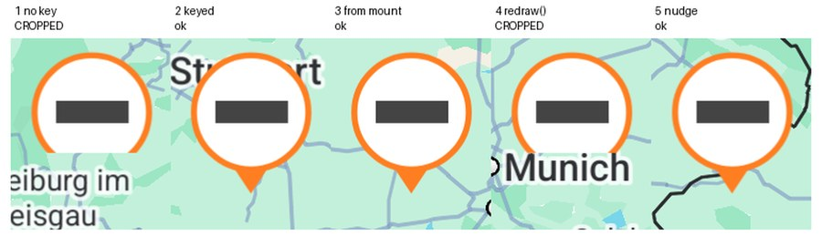
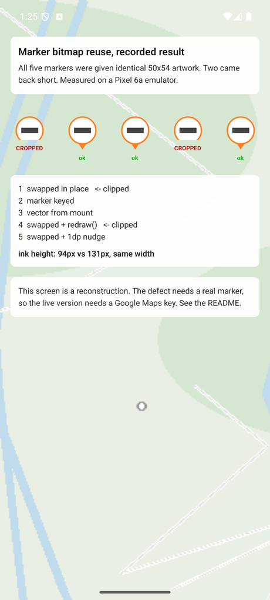
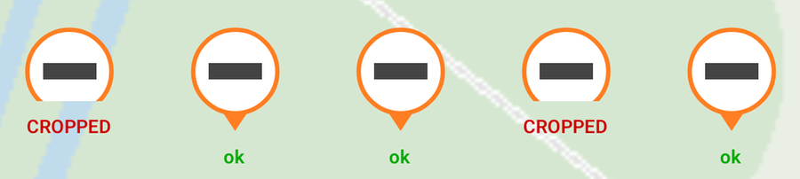
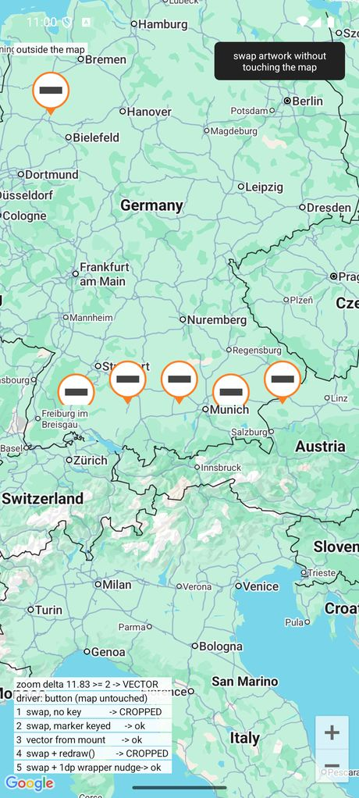

# react-native-maps — a marker reuses its bitmap, so swapped artwork is clipped

Android. All five markers below were handed the **same** 50x54 teardrop. Two came back
without their tail.



| | |
|---|---|
| react-native | 0.81.4 |
| react-native-maps | 1.26.18 |
| react-native-svg | 15.14.0 |
| reproduced on | Pixel 6a emulator, API 36, density 2.625 |

## What you are looking at

**Why a marker can go wrong at all.** On Android, Google Maps will not host live views inside
a marker. So react-native-maps takes a photograph of whatever you put in the marker and hands
that picture to the map. Everything you see in a custom marker is a bitmap, not the views you
wrote.

**The defect.** The library keeps that bitmap and reuses it. It throws it away and allocates a
new one only when the marker's **size** changes. Nothing else triggers it, not a content
change, not a redraw request.

So if you replace a marker's artwork with different artwork of the same size, the library is
never told anything happened. It paints the new artwork into the buffer it already had, and
what comes out is short.

**Why these two pins and not the others.** All five swap a grey image for an orange vector at
the same moment. What differs is what happens to the marker around them.

| pin | what happens to the marker | outcome |
|---|---|---|
| 1 | nothing, it survives the swap | buffer reused, **clipped** |
| 2 | React rebuilds it, because it is keyed on the artwork | new marker, new buffer |
| 3 | never swaps at all | nothing to go stale |
| 4 | survives, and `redraw()` is called | redraw uses the same buffer, **still clipped** |
| 5 | survives, but the wrapper grows by one point | size changed, so new buffer |

Pins 4 and 5 are the pair that makes this a report rather than a guess. Asking the marker to
redraw itself changes nothing. Nudging its size by a single point fixes it. The only
difference between those two actions is whether a fresh bitmap gets allocated, which is what
pins the blame on the buffer rather than on layout or on the change tracker.

**What makes it reachable in ordinary code.** The library watches only the marker's first
child for size changes. The pin here is a grandchild, sitting inside a wrapper that reserves
space above it for a badge. Wrappers like that are completely normal. Take the wrapper away
and the bug vanishes, because the pin becomes the first child and gets watched.

**One distinction about what you run.** The static screen is a reconstruction: it clips those
two pins deliberately, to the geometry measured on a real device. The live screen is the
actual reproduction. The defect only exists inside a real marker, so a screen without a map
can show you the result but cannot produce it.

## Where it happens in the library

A marker cannot host live views on Android, so the library photographs its children into a
bitmap. It keeps that bitmap and reuses it, discarding it only when the marker's **size**
changes:

```java
// MapMarker.createDrawable()
Bitmap bitmap = mLastBitmapCreated;
if (bitmap == null || bitmap.isRecycled()
    || bitmap.getWidth() != width || bitmap.getHeight() != height) {
    bitmap = Bitmap.createBitmap(width, height, ARGB_8888);   // fresh
    mLastBitmapCreated = bitmap;
} else {
    bitmap.eraseColor(Color.TRANSPARENT);                      // reused
}
this.draw(new Canvas(bitmap));
```

`mLastBitmapCreated` is cleared in one place only, `clearDrawableCache()`, reached from
`update(int width, int height)` — which runs from a layout listener that
`MarkerManager.addView` attaches to **the child at index 0**.

So if you replace a marker's artwork with something the same size, nothing re-measures, the
bitmap is reused, and the new artwork is drawn short.

## Two screens

| file | map | needs a key | shows |
|---|---|---|---|
| `src/StaticDemo.tsx` | a static image | **no** | the recorded result |
| `src/LiveMapRepro.tsx` | real Google map | yes | the defect happening live |

`App.tsx` renders the static screen, so the project runs from a clean clone with nothing
configured. Swap its single import for the live one when you have a key.



The static screen is a **reconstruction**. It clips the two broken pins to the geometry
measured on device, dropping the bottom 15dp. It cannot reproduce the defect, because the
defect lives in the marker's bitmap handling and only exists inside a real `<Marker>`.



## Run it

```bash
npm install
npx react-native run-android
```

That gives you the static screen. For the live one, supply a Google Maps key and change the
import in `App.tsx`:

```
# ~/.gradle/gradle.properties
MAPS_API_KEY=AIza...
```

The build reads it via `project.findProperty('MAPS_API_KEY')` and injects it as a manifest
placeholder inside `<application>`, so no key is committed. Without a valid key the Maps SDK
throws `IllegalStateException: API key not found` and the process dies; with an invalid one
the map fails authorization and draws nothing at all, markers included.



## The measurements

A sixth copy renders outside the map and stays correct throughout, which shows the artwork
itself is fine.

Measured ink height in screen pixels:

| pin | 1 | 2 | 3 | 4 | 5 |
|---|---|---|---|---|---|
| width | 112 | 113 | 113 | 113 | 112 |
| height | **94** | 131 | 131 | **94** | 131 |

Identical width in all five, so only the vertical is wrong. The 37px shortfall is about 14dp
at this density, which is the wrapper's 15dp top margin. The same numbers appear in the
production app this was extracted from, 95 against 133.

## Zoom hides it

In the live screen there are two ways to swap the artwork, and only one reproduces the defect.

| driver | what it does | result |
|---|---|---|
| zoom | vector when zoomed out, raster when zoomed in, mirroring the app this came from | **does not reproduce** |
| button | flips the artwork with the map untouched | **reproduces every time** |

A camera change refreshes the markers, which discards the stale bitmap as a side effect, so
the bug hides whenever the swap rides along with a zoom. It needs the artwork to change while
the map is still. Measured over three zoom cycles, every pin stayed at 131px. In the original
app the same thing showed up as the defect sparing any car that had just been re-clustered.

## Why the structure matters

`src/Pin.tsx` mirrors a production marker on purpose:

```
wrapper View          <- the marker's child at index 0; its size never changes
  pin (absolute)      <- swaps between <Image> and <Svg>; a GRANDCHILD of the marker
  overlay (in flow)
```

Put the pin directly under the `<Marker>` with no wrapper and the bug disappears: the pin is
then index 0 itself, gets a layout listener, and the bitmap is discarded. The wrapper is what
hides the change, and wrappers are ordinary — ours exists to reserve space above the pin for
a badge.

## What a fix would look like

The drawable cache is keyed on dimensions alone, so any content change that preserves the
marker's size reuses a bitmap it should not. Either invalidate the cache when the subtree
changes rather than only when the bounds do, or attach the layout listener to the whole
subtree instead of only the child at index 0.

## Workaround

Give the `<Marker>` a key derived from whatever selects the artwork, so React unmounts and
remounts it. That is pin 2. Neither `tracksViewChanges` nor `redraw()` is sufficient.
